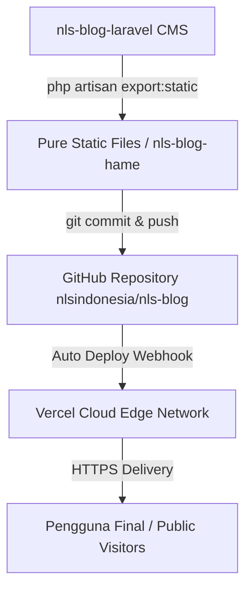

# 🏛️ Arsitektur Sistem — Next Level Study (NLS)

Dokumen ini menjelaskan rancangan arsitektur, struktur data, aliran deployment, serta alur kerja teknis untuk situs web publik **Next Level Study** (`nls-blog-hame`).

---

## 1. 📌 Gambaran Umum (Overview)

Website **Next Level Study** menggunakan pendekatan **Jamstack / Standalone Pure Static Site** yang ringan, cepat, dan terdistribusi secara global melalui **Edge Network Vercel CDN**.

- **URL Production**: [https://nls-blog-plum.vercel.app](https://nls-blog-plum.vercel.app)
- **Repository Git**: [https://github.com/nlsindonesia/nls-blog.git](https://github.com/nlsindonesia/nls-blog.git)
- **Branch Utama**: `main`

---

## 2. 🏗️ Alur Kerja & Sumber Data (Architecture Flow)



1. **Content Management System (CMS)**:
   Konten artikel, produk, program pelatihan, dan media diolah di backend `nls-blog-laravel`.
2. **Static Export Generator**:
   Perintah `php artisan export:static` menghasilkan output static HTML/CSS/JS mandiri ke repository ini.
3. **Continuous Deployment**:
   Tindakan `git push` ke branch `main` pada repository GitHub secara otomatis memicu pencetakan build dan deployment di Vercel.

---

## 3. 🛠️ Tech Stack & Dependensi

- **Frontend Core**: Standard HTML5 & Native JavaScript (ES6+)
- **Reactive State & Modals**: Alpine.js
- **Styling & Design Tokens**: TailwindCSS / Compiled Asset Bundle (`/build/assets/app-*.css`, `/build/assets/app-*.js`)
- **Web Server Configuration**: `vercel.json` (Custom 404 rewrite, Clean URLs, Trailing Slash rule)
- **Local Dev Server**: Node.js `serve` (`npm run dev` di port `3000`)

---

## 4. 📁 Struktur Direktori & Routing

| Path Rute | File Sumber | Keterangan |
|---|---|---|
| `/` | `index.html` | Halaman Beranda (Hero, Program, Galeri Bimbel NLS, Testimoni, Alumni) |
| `/tentang/` | `tentang/index.html` | Profil & Visi Misi Next Level Study |
| `/mitra/` | `mitra/index.html` | Kemitraan Sekolah & Daftar Instansi |
| `/privat/` | `privat/index.html` | Informasi & Pendaftaran Program Les Privat |
| `/belajar/` | `belajar/index.html` | Katalog Kursus Online (OSN, UTBK, TKA) |
| `/products/` | `products/index.html` | Produk Edukasi & Paket Pelatihan |
| `/programs/` | `programs/index.html` | Program Unggulan Pelatihan Siswa & Guru |
| `/blog/` | `blog/index.html` | Artikel Edukasi, Pengumuman & Berita NLS |
| `/achievements/` | `achievements/index.html` | Galeri Prestasi & Medali Siswa NLS |
| `/terms/` & `/privacy/` | `terms/index.html`, `privacy/index.html` | Syarat & Ketentuan serta Kebijakan Privasi |

---

## 5. 🚀 Panduan Deployment & Git Workflow

Untuk menyelaraskan perubahan dokumen arsitektur dan kode ke Vercel:

```bash
# 1. Cek status repository
git status

# 2. Tambahkan perubahan file
git add aristektur.md

# 3. Commit perubahan
git commit -m "Update dokumentasi arsitektur sistem NLS"

# 4. Push ke GitHub (Vercel otomatis mendeploy)
git push origin main
```
